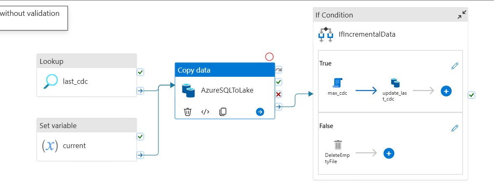
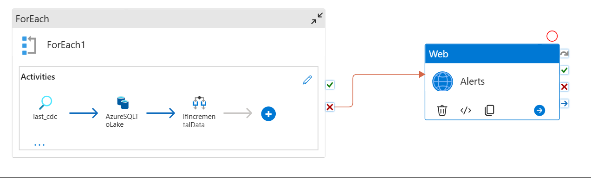
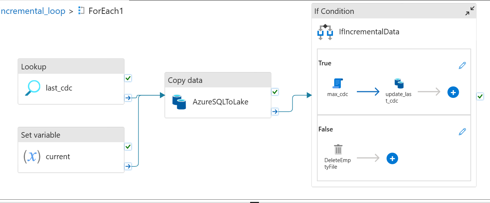
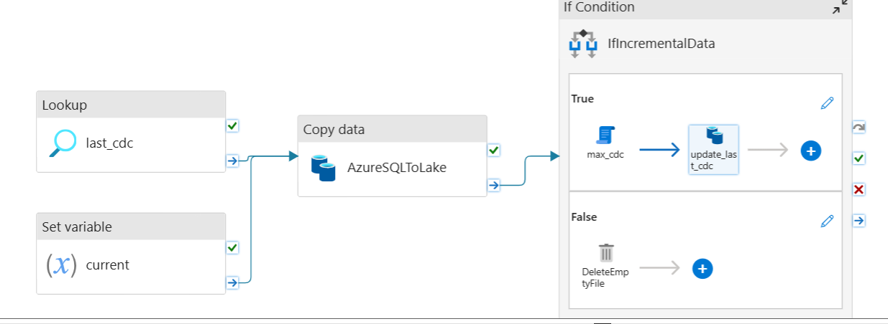

# Spotify Data Engineering Pipeline Project

## 📌 Overview

This project implements an **end-to-end modern data engineering pipeline** designed for scalable, reliable, and production-grade analytics. It supports **batch and streaming ingestion**, **incremental processing**, **Delta Lake-based transformations**, and **star-schema modeling** for downstream analytics and warehousing.

The architecture follows **lakehouse principles**, enabling data quality, governance, and performance while remaining cloud-native and CI/CD friendly.

---

## 🧱 Tech Stack

* **Azure Data Factory** – Orchestration and ingestion
* **Azure Data Lake Storage (ADLS)** – Centralized data lake
* **Databricks** – Data processing and transformations
* **Apache Spark** – Distributed batch & stream processing
* **Delta Lake** – ACID transactions, versioning, and reliability
* **Delta Live Tables (DLT)** – Declarative pipeline management
* **SQL** – Transformations and analytics
* **GitHub** – Version control & CI/CD
* **Azure Security (AAD, Key Vault)** – Authentication & secrets

---

## 🏗️ Architecture Overview

### 1. Data Sources

* Relational databases (SQL)
* Version-controlled data inputs (GitHub)

### 2. Ingestion Layer

* Azure Data Factory pipelines ingest raw data
* Data lands in **Bronze layer** of the Data Lake

### 3. Processing Layer (Databricks)

* Apache Spark processes batch and streaming data
* Delta Lake ensures ACID compliance
* Incremental loads using watermarking

### 4. Transformation Layer

* Delta Live Tables manage:

  * Data quality checks
  * Dependencies
  * Automatic retries
* Star schema modeling using Spark SQL

### 5. Analytics & Warehouse

* Curated **Gold layer** tables
* Optimized for BI and analytics consumption

---

## ⭐ Data Modeling

* **Star Schema Design**

  * Fact tables for measurable events
  * Dimension tables for descriptive attributes
* Optimized for analytical queries
* Ensures high performance and scalability

---

## ⚙️ Key Features

* Incremental data processing
* Streaming + batch support
* Backfilling enabled
* Metadata-driven pipelines
* Declarative transformations (DLT)
* Dynamic and reusable code
* CI/CD-ready with Git standards
* Secure secret management

---

## 📋 Screenshots/Demo

---

## 📄 License

This project is intended for educational and portfolio purposes.

---

⭐ *If you’re a recruiter or interviewer: this project demonstrates modern data engineering best practices at scale.*
